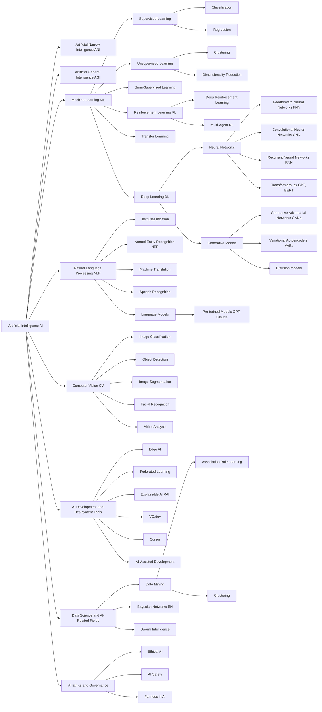

# ai_dev
Mastering AI Development: From Foundations to Advanced with VO.dev, Cursor, and Claude 3.5

```mermaid
graph LR
    A[Artificial Intelligence AI] --> B[Artificial Narrow Intelligence ANI]
    A --> C[Artificial General Intelligence AGI]
    A --> D[Machine Learning ML]
    
    D --> D1[Supervised Learning]
    D --> D2[Unsupervised Learning]
    D --> D3[Semi-Supervised Learning]
    D --> D4[Reinforcement Learning RL]
    D --> D5[Transfer Learning]
    D --> D6[Deep Learning DL]
    
    D1 --> D1A[Classification]
    D1 --> D1B[Regression]
    
    D2 --> D2A[Clustering]
    D2 --> D2B[Dimensionality Reduction]
    
    D4 --> D4A[Deep Reinforcement Learning]
    D4 --> D4B[Multi-Agent RL]
    
    D6 --> D6A[Neural Networks]
    D6A --> D6A1[Feedforward Neural Networks FNN]
    D6A --> D6A2[Convolutional Neural Networks CNN]
    D6A --> D6A3[Recurrent Neural Networks RNN]
    D6A --> D6A4[Transformers  ex GPT, BERT]
    
    D6 --> D6B[Generative Models]
    D6B --> D6B1[Generative Adversarial Networks GANs]
    D6B --> D6B2[Variational Autoencoders VAEs]
    D6B --> D6B3[Diffusion Models]
    
    A --> E[Natural Language Processing NLP]
    E --> E1[Text Classification]
    E --> E2[Named Entity Recognition NER]
    E --> E3[Machine Translation]
    E --> E4[Speech Recognition]
    E --> E5[Language Models]
    E5 --> E5A[Pre-trained Models GPT, Claude]
    
    A --> F[Computer Vision CV]
    F --> F1[Image Classification]
    F --> F2[Object Detection]
    F --> F3[Image Segmentation]
    F --> F4[Facial Recognition]
    F --> F5[Video Analysis]
    
    A --> G[AI Development and Deployment Tools]
    G --> G1[Edge AI]
    G --> G2[Federated Learning]
    G --> G3[Explainable AI XAI]
    G --> G4[VO.dev]
    G --> G5[Cursor]
    G --> G6[AI-Assisted Development]
    
    A --> H[Data Science and AI-Related Fields]
    H --> H1[Data Mining]
    H1 --> H1A[Association Rule Learning]
    H1 --> H1B[Clustering]
    H --> H2[Bayesian Networks BN]
    H --> H3[Swarm Intelligence]
    
    A --> I[AI Ethics and Governance]
    I --> I1[Ethical AI]
    I --> I2[AI Safety]
    I --> I3[Fairness in AI]
```
